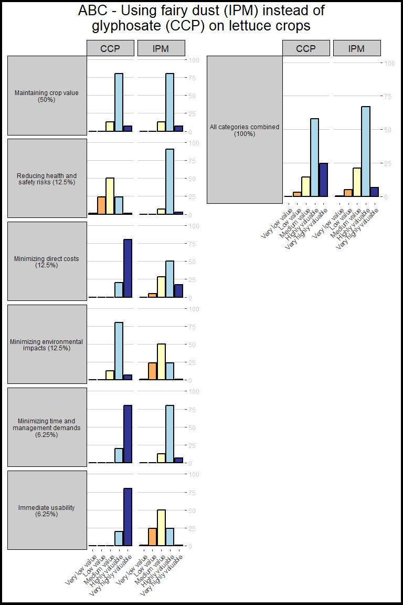

<!-- README.md is generated from README.Rmd. Please edit that file -->

# ipmopat

<!-- badges: start -->
<!-- badges: end -->

The goal of **ipmopat** is to provide open-source processing of data
elicited from projects in the ADOPT-IPM consortium. It is an Integrated
Pest Management (IPM) Open-source Performance Assessment Tool (OPAT),
thus the clunky name, IPMOPAT.

## Quick overview of data flow

1.  An ADOPT-IPM project leader or collaborator will choose a Common
    Commercial Practice (CCP) and a new IPM-based method to compare.
2.  The expert will assign weights to each of the six value categories,
    according to their priorities:

- Crop value
- Health and safety
- Direct costs
- Environment
- Time and management
- Coordination requirements

3.  Starting with the CCP scenario, the expert will rate each value
    category:

- Very low value
- Low value
- Medium value
- High value
- Very high value

4.  The expert will also assign a confidence level to their ratings:

- Low
- Medium
- High
- Very High

5.  The expert will repeat steps 3 and 4 for the IPM scenario
6.  This **impopat** R package will

- take those ratings/confidence level pairs, and create value
  distributions for each of the six categories
- combine the six categories into a summary value distribution, based on
  the user
- create visualizations that compare the value of the two scenarios

## Installation

You can install the development version of ipmopat from
[GitHub](https://github.com/) with:

``` r
# install.packages("pak")
pak::pak("vanichols/ipmopat")
```

## Example

Look at example data template for comparing glyphosate and fairy dust in
lettuce for weed control

``` r
library(ipmopat)

ipm_exampdat %>% 
  dplyr::select(short, weight, ccp_rating, ccp_confidence, ipm_rating, ipm_confidence)
#> # A tibble: 6 × 6
#>   short               weight ccp_rating ccp_confidence ipm_rating ipm_confidence
#>   <chr>                <dbl> <chr>      <chr>          <chr>      <chr>         
#> 1 crop value           50    low impact H              low impact H             
#> 2 health and safety    12.5  medium im… M              low impact VH            
#> 3 direct costs         12.5  very low … H              low impact M             
#> 4 environment          12.5  low impact H              medium im… M             
#> 5 time and management   6.25 very low … H              low impact H             
#> 6 coordination requi…   6.25 very low … H              medium im… M
```

See more details about the categories, it will have some more detail
added as we refine the questionaire…

``` r
ipm_shortinfo
#> # A tibble: 6 × 3
#>   value_metric                           short                     question     
#>   <chr>                                  <chr>                     <chr>        
#> 1 Maintaining crop value                 crop value                Crop value l…
#> 2 Reducing health and safety risks       health and safety         Worker (non-…
#> 3 Minimizing direct costs                direct costs              The cost of …
#> 4 Minimizing environmental impacts       environment               The potentia…
#> 5 Minimizing time and management demands time and management       The time and…
#> 6 Immediate usability                    coordination requirements The coordina…
```

Create distributions of ‘value’ for each pest management scenario within
each of the six metrics:

    #> # A tibble: 6 × 8
    #>   title                  weight short rating confidence score value_bin scenario
    #>   <chr>                   <dbl> <chr> <chr>  <chr>      <dbl>     <dbl> <chr>   
    #> 1 ABC - Using fairy dus…   50   crop… low i… H             14         5 CCP     
    #> 2 ABC - Using fairy dus…   50   crop… low i… H             80         4 CCP     
    #> 3 ABC - Using fairy dus…   50   crop… low i… H              6         3 CCP     
    #> 4 ABC - Using fairy dus…   50   crop… low i… H              0         2 CCP     
    #> 5 ABC - Using fairy dus…   50   crop… low i… H              0         1 CCP     
    #> 6 ABC - Using fairy dus…   12.5 heal… mediu… M              1         5 CCP

Use the results from Ratings2Distributions, and combine the six metrics
into one summary

    #> # A tibble: 6 × 6
    #>   title                             scenario short value_metric value_bin  score
    #>   <chr>                             <chr>    <chr> <chr>            <dbl>  <dbl>
    #> 1 ABC - Using fairy dust (IPM) ins… CCP      all   All categor…         1  0.132
    #> 2 ABC - Using fairy dust (IPM) ins… CCP      all   All categor…         2  3.01 
    #> 3 ABC - Using fairy dust (IPM) ins… CCP      all   All categor…         3  9.99 
    #> 4 ABC - Using fairy dust (IPM) ins… CCP      all   All categor…         4 58.0  
    #> 5 ABC - Using fairy dust (IPM) ins… CCP      all   All categor…         5 28.9  
    #> 6 ABC - Using fairy dust (IPM) ins… IPM      all   All categor…         1  0.308

Finally, you can visualize the results in either a dot plot or a bar
graph

    #> Joining with `by = join_by(short)`


